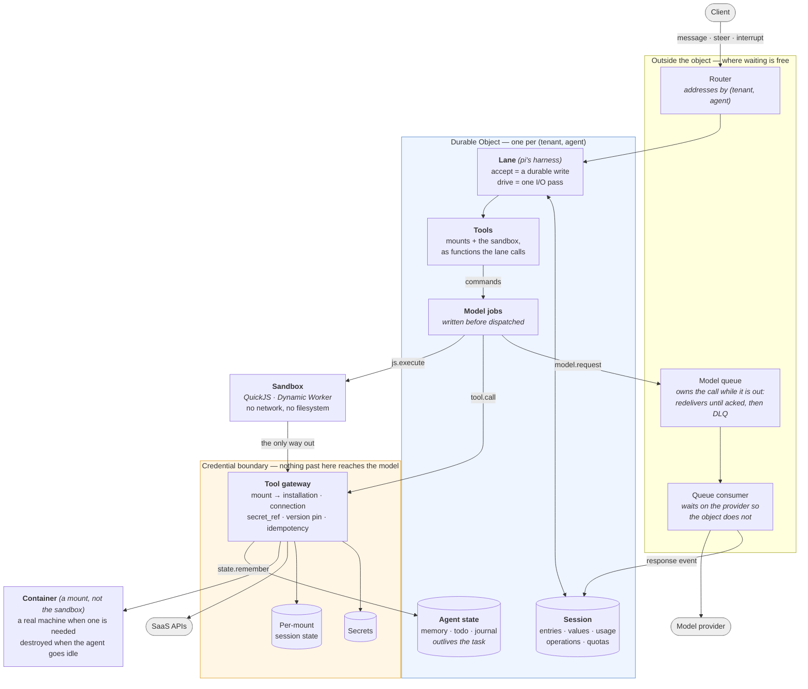

# antiproton

> A durable, multi-tenant runtime for AI agents that interact with real-world systems, built on serverless infrastructure that costs nothing while idle.

The agent loop itself is commodity — bring your own, or use the reference harness. Antiproton provides the durable execution substrate underneath it, designed around four core architectural guarantees:

- **Structural multi-tenancy:** Distinct tenants execute in discrete Durable Objects backed by dedicated SQLite databases. Cross-tenant data is physically absent from the querying database rather than filtered by application `WHERE` clauses.
- **Serverless durability:** Runs in the cloud without long-lived background daemons, local laptop requirements, or state directories. Agents survive crashes, process evictions, and code deployments, resuming execution transparently.
- **True scale-to-zero:** Idle agents consume zero compute: no active processes, no background polling, no armed timers, and no active containers. Inactive state costs storage only; incoming requests reconstruct the agent from its event log.
- **Zero-trust credential isolation:** Agents act on external APIs and systems without credentials ever entering model context prompts, tool outputs, or execution logs.

---

## Table of Contents

- [OpenAI Agents API Guide](docs/agents-api.md)
- [Plugin Authoring Guide](docs/plugins.md)
- [Philosophy & Design Principles](docs/philosophy.md)
- [Architecture](#architecture)
- [Getting Started](#getting-started)
- [Core Invariants](#core-invariants)
  - [Zero Cost While Idle](#zero-cost-while-idle)
  - [Zero-Trust Security & Credential Isolation](#zero-trust-security--credential-isolation)
  - [Context Window Bounding & Compaction](#context-window-bounding--compaction)
  - [Persistent Memory](#persistent-memory)
  - [Storage Substrate](#storage-substrate)
- [Verification & Benchmarks](#verification--benchmarks)
- [Contributing](#contributing)
- [What Was Taken From Elsewhere](#what-was-taken-from-elsewhere)
- [What Is Not Done](#what-is-not-done)

---

## Architecture



Four things the picture is meant to make obvious:

1. **The sandbox has exactly one exit.** It has no network and no filesystem;
   the only thing it can do is call the gateway, which decides what that means.
2. **Credentials sit on the far side of the gateway.** The model produces a
   mount alias and arguments. It never produces, sees, or stores a credential.
3. **The object is the tenant boundary.** Two tenants are two Durable Objects
   with two SQLite databases, so cross-tenant data is not in the database being
   queried — and the object refuses an identity that is not its own.
4. **A container is a mount, not a loophole.** Work that genuinely needs a real
   machine gets one, but it is reached the same way a SaaS API is — through the
   gateway, under the mount's policy — rather than by loosening the sandbox. It
   holds no credential of the agent's, and it is destroyed when the agent has
   nothing open, on the same agent-wide scope as above.

### Policy, and the gate

A mount carries a policy — `{read, write, tools}`, each `allow`, `deny` or
`approval`. A denied tool never reaches the plugin. A call marked `approval`
is not performed: the operation is recorded, the task **parks on it**, and a
person sees the request verbatim and signs it. The decision wakes the task,
and the call is then performed exactly once.

**A gate binds the mount it is set on, so two mounts of one plugin are two
authorities.** That is worth stating because the default runs the other way: a
mount with no policy at all allows every tool it exposes, so an ungated mount of
the same plugin sitting beside a gated one is a door beside the gate rather than
a second opinion. Nothing stops a second alias being added — that is what mounts
are for — so the property to check is the agent's whole mount set, not the policy
on the mount you are looking at.

The parking matters more than it sounds. Answering a held call with an error
made the agent announce it could not proceed and stop; told instead that it is
paused and a decision is coming, the same task went from a 75s failure to a
17.2s success. Two mounts of one plugin can carry different policies, which is
how two accounts of the same SaaS get different authority.

### The step

Admission and work are separate calls, and that separation is the design:

```
accept()   a pure write — the message is durable before anything is answered
drive()    one I/O pass — returns `waiting` rather than blocking
resume     the next alarm picks up whatever was left open
```

`accept` returns at once, so a person's message survives a crash that happens
before the model is even asked. `drive` never waits for a model: the provider
here answers `deferred` with a handle, the operation suspends durably, and the
object stops being active while the queue does the waiting. Nothing needs a
lease or a fencing token, because a Durable Object is single-threaded and pi's
mutation line serialises the writes — there was never a second writer for them
to protect against.

Effects the object cannot re-run safely are marked. A tool declares
`sideEffects` and `idempotency`, which becomes pi's `replay: "never" | "safe"`:
a read repeats freely, a write repeats only if the plugin can make it
idempotent, and everything else is answered `unknown` rather than performed
twice.

### Tools are called the provider's way

The harness offers the mounted tools through the provider's own tool-calling
channel and reads `tool_calls` back. That sounds like a detail and is not.

The alternative — asking the model, in prose, to reply in a convention invented
here — was the default until a model change broke it in public. A model under
any pressure falls back to the format it was trained on, and every provider
trains a different one. Four turned up in two days: `<tool_call>`, `<invoke>`,
an invented `<system name="...">`, and DeepSeek's DSML written with full-width
bars. Each arrived as another branch in a regex, and each time the harness had
read the markup as a finished answer and ended the task mid-job.

Measured on the same model, prompt and task: through the invented convention,
16s, one model call and no tool calls at all — it emitted markup, the harness
took it for an answer, and it replied from memory against an explicit
instruction not to. Through the provider's channel: 91s, twelve model calls,
thirty tool results, and an answer that had read the repository.

The invented convention is gone with the harness that used it: pi's loop calls
tools through the provider's channel and nothing else, so there is no regex left
to teach.

---

## Getting Started

### Prerequisites

- **Node.js**: >= 24 (Node 24+ native TypeScript support with `--experimental-strip-types` / strip-only TS is used; no build step required for Node scripts).
- **Package manager**: `npm`.
- **Cloudflare account** (optional, for edge deployment): Wrangler CLI and a Cloudflare account with Workers and Durable Objects enabled.
- **Model API key**: e.g. OpenRouter, Anthropic, or OpenAI key.

### Installation

Clone the repository and install dependencies:

```bash
git clone https://github.com/botiverse/antiproton.git
cd antiproton
npm install
```

### Running Tests

The test suite covers in-process storage conformance, agent loop semantics, tool isolation, compaction, and sandbox contracts:

```bash
# Run individual unit or conformance test suites (Node 24+ native TS strip)
node test/pi-storage.ts
node test/pi-agent.ts
node test/state.ts

# Or run predefined npm scripts for key suites
npm run pi-storage
npm run pi-agent
npm run pi-tools

# Run type checks (Node scripts and Cloudflare Worker checked independently)
npm run typecheck
```

Three integration tests require live external credentials and are skipped in standard unit runs:
- `test/live-e2e.ts`: Live end-to-end multi-turn agent test (`RUN_LIVE_TESTS=1`).
- `test/live-github.ts`: Real GitHub tool operations against a test repository (`GITHUB_TOKEN=...`).
- `test/appworld.ts`: AppWorld benchmark evaluation against an active AppWorld environment.

### Local Development & Edge Deployment

Antiproton is designed to run as a Cloudflare Worker backed by Durable Objects:

1. **Configure credentials:**
   Copy the example environment or configure credentials in `cf/wrangler.jsonc` (or via Cloudflare Secrets):
   ```bash
   npx wrangler secret put ANTHROPIC_API_KEY
   # or OPENROUTER_API_KEY, etc.
   ```

2. **Run locally with Wrangler:**
   ```bash
   cd cf
   npx wrangler dev
   ```

3. **Deploy to Cloudflare Workers:**
   ```bash
   ./deploy.sh
   ```
   The deployment script executes verification gates before uploading the Worker and running smoke checks.

---

## Core Invariants

### Zero Cost While Idle

Scale-to-zero is easy to claim and easy to lose one careless `await` at a time,
so the numbers below are measured on the deployment rather than reasoned about.

Durable Objects bill **wall-clock duration while the object is active**; Workers
bill **CPU**, and time spent waiting on I/O is free. A model call is five to
sixty seconds of pure waiting. Awaiting it inside the object means paying for
the wait; that one distinction drives most of the design.

| | Measured |
|---|---|
| Model call awaited inside the object | 128.2s of billed object time |
| The same work, awaited off it | **0.7s** |
| One agent, 79 model calls | 40.8s billed inside vs **709.2s waited outside** (582.5s of it the provider) |
| Idle agent | no invocations, no armed alarm, no container |

Three things had to be true for the last row, and each was a bug first:

- **The alarm stands down.** It used to re-arm every 30 seconds for the life of
  the object. An idle object now deletes its alarm and wakes only when something
  arrives.
- **Nothing polls.** Work in flight belongs to a queue, which redelivers until
  acked and gives up into a dead-letter queue. The object does not stay awake to
  supervise it. (It used to: the sweeper, the give-up timer and the re-dispatch
  loop were a hand-rolled reimplementation of one line of a queue's contract.)
- **The sandbox is handed back.** A container is destroyed when the agent has
  nothing open, not stopped — `stop` returns 200, leaves the box and its storage
  in place, and keeps billing. Thirteen boxes were live before that was noticed.
  The release is scoped to the agent and covers every mount it holds, so it fires
  when the *agent* has nothing open rather than when a particular task ends. The
  condition is per pass, not per conversation: a wake that settles a turn and
  opens no new one releases, so a container is handed back between turns of the
  same conversation rather than only at its end. A mount whose plugin keeps
  something across calls should therefore expect to be released and re-entered
  rather than held — `run9` preserves the environments named in `envs` for that
  reason, and anything a container accumulates that is not named there is gone.

The other half of cost is tokens, and the number that decides it is prompt-cache
hit rate. Measured here: editing the system message drops it from **84.9% to
0.0%** — 6.6x the uncached tokens — while editing the tool block costs 1.1x. So
the agent's memory is injected once when the harness opens rather than before
every turn, which is where a local harness would put it. The injection is built
from tenant and agent rather than from anything per conversation, so the harness
opening decides how often it is paid. The console draws the cache
hit per call, so losing it is visible rather than merely expensive.

The cache is not the whole story, though: on a long investigation it sits above
99% and the bill still climbs, because each fetched page is re-sent on every
subsequent turn. That is what compaction is for, below.

### Zero-Trust Security & Credential Isolation

> **The agent acts on your systems, and its context never contains your keys.**

Most agent setups put credentials in the model's context — an API key in the
prompt, an OAuth token in a tool result, or a tool that fetches one. That makes
prompt injection a credential-exfiltration path, puts tokens through the model
provider and the logs, and leaves no clean answer to "who did this, under whose
authority".

The benchmark that demonstrates the alternative is [AppWorld][appworld]: 9 apps,
457 APIs, **362 of them (79%) behind an access token**. AppWorld's own interface
expects the agent to read the supervisor's passwords, call each app's `login`,
and carry the token itself. Here the nine apps are nine ordinary mounts:

| | AppWorld's native interface | This runtime |
|---|---|---|
| Where credentials live | the agent's context | `secret_ref`, dereferenced server-side |
| Who logs in | the agent | the gateway |
| Where the token is kept | the agent's context | the mount's database |
| What the model sees | passwords, tokens, Python | `spotify.show_song({song_id})` |

Nine end-to-end cases assert it against the live servers: no schema mentions
`access_token`, the credential-reading tool is not mounted, an authenticated
call succeeds without the agent ever logging in, and the token never appears in
a tool result.

An operator attaches a credential for a mount from the console. It is stored in
the agent's own object — **per agent, so a token attached under one agent is not
there under the next**, which is the same boundary the mount scope comes from
rather than a limitation of the page — sealed with AES-GCM under a Worker-held
key: the row
holds ciphertext and an IV, and no fragment of the value. The reference
takes the form `agent:<name>` beside `env:NAME`, and resolves only against the
(tenant, agent) that owns the mount naming it — the resolver takes its scope from
the mount, not from the reference, so no reference one agent can write reaches
another's store. Nothing returns the value: not the console, not a tool result,
not a transcript entry. A plugin that can check a credential reports the account
it authenticated as, which is also the only credential-derived string the page
shows.

Dereferencing server-side decides who may *use* a credential. It does not by
itself decide where one may be *sent*, and for most plugins the host is fixed by
the plugin rather than chosen by the agent — so the question does not arise. The
`http` mount is the exception: the agent supplies the URL, so a credential on it
would go wherever the agent points it, and a setting (`allowedHosts`) is the only
thing bounding that. A mount carrying a credential therefore **must bound where
that credential may be sent**, and the bound is declared by the field the plugin
requires — for `http`, `allowedHosts`. The check reads *this mount's*
`secret_ref` rather than what the plugin is able to carry, because a mount can
hold a key before its plugin ever declares one and the hazard does not wait for
the declaration. It runs twice: when the mount is provisioned, and again when a
credential is later attached to it, so that attaching afterwards is not a way
around a refusal the seed path would have made. A mount carrying no credential
may leave the list unset, and then any public host is reachable.

  **How a person gets in.** The console authenticates through a GitHub OAuth
  app; there is no per-person password and no session the deployment keeps.
  (An operator also has a long shared key a deployment can enable for
  testing, which is an identity of its own and not a person's account.) A
  sign-in that resolves to a row in the identity table lands on that row's
  agent. The table is the whole of the admission rule: an account not on it
  is refused, and a deployment can instead run open sign-up, in which a
  first sign-in writes its own row and gets a new agent — seven seeded
  mounts, an empty memory, and a **tenant of its own**, so one person's
  quota and storage are not another's.

[appworld]: https://github.com/StonyBrookNLP/appworld

### Context Window Bounding & Compaction

A long investigation outgrows any context window, and what it has learned is
the part worth keeping. Dropping old turns keeps the task alive and throws the
findings away.

So, following [pi][pi] — see [what was taken from elsewhere](#what-was-taken-from-elsewhere) —
walk back from the newest message to a budget and keep
that tail verbatim; summarise everything before it into a handover with fixed
sections — goal, constraints, progress, decisions, next steps; truncate tool
output hard, or the summariser summarises a fetched page instead of the work;
and on a second pass feed the previous handover back with an update prompt that
says to merge rather than append.

Four triggers, two of them estimates and two facts. A share of the model's
context window, and a share of the checkpoint budget — both estimates, and both
expressed as fractions, because the same token count is most of a small window
and a rounding error in a large one. Then the two certain ones: the provider
refusing the call because the prompt does not fit, which forces a compaction
rather than a retry that cannot succeed; and a person pressing **compact now**.

It fits here better than it fits pi, because the harness holds no I/O:
compaction is a command like any other. The request declares its purpose, so
the reply is a record in the log of where a compaction happened and what was
folded up.

Nothing is destroyed. `state = fold(events)`, the log is untouched, and only
what the model is shown gets shorter — the console says so where it happened.

Demonstrated end to end: compaction fired on its own, produced a handover with
the goal and per-page progress intact, and the agent then answered two questions
whose answers had been fetched *before* the compaction, without going back to
re-read anything.

### Persistent Memory

An agent that cannot write anything down re-derives everything on every task,
and it knows it: asked to keep a note, this one used to answer that it had
nowhere to keep one. It now has its own store, per `(tenant, agent)`, outliving
any single task — small values in the object's SQLite, large ones spilled to
object storage behind an `r2://` reference the existing reader can page.

The shape follows what [pi-memory][pim] and Codex arrived at independently:
plain text documents a person can read and correct, separate documents for
separate lifetimes (`memory` for durable facts, `todo` for what is open,
`journal` for what happened), and appending in one call — a journal you have to
read, edit and rewrite to add a line is a journal that stops being written.

The load-bearing part is theirs too: the working set is **pushed into the
prompt**, not left to be pulled, because an agent that has to remember to go and
look will not look. What does not carry over is doing it before every turn. That
is affordable in a local CLI and not here — see the cache numbers above — so it
is injected once when the harness opens, where the prefix stays stable and
cached.

Demonstrated across two tasks: told a deploy window, a formatting preference and
an unhandled certificate expiry in one, then asked in a *new* task when to ship,
it answered with the next Tuesday's date at 02:00 UTC, raised the certificate
unprompted, and formatted the reply the way it had been asked to.

[pim]: https://github.com/jayzeng/pi-memory

### Storage Substrate

One contract, two implementations, no third:

| Backend | Where | pi storage conformance |
|---|---|---|
| `PiSqliteStorage` on node:sqlite | in-process (Node) | 21/21 |
| `PiSqliteStorage` on DO SQLite | Cloudflare | 21/21 |

A db9/Postgres backend also passed, and was removed: 61,219 ms against sqlite's
162 ms, no `SERIALIZABLE`, and `40001` on plain concurrent inserts. A backend
that passes but is never run is a liability, not an asset — it has to be updated
on every seam change while nobody exercises it.


---

## What is verified

Contracts, not assertions in prose. The storage contract runs unchanged against
both backends, and it is not ours — it ships with pi, which is the point of
implementing pi's interface rather than copying its design.

**The measurement standard: a figure counts as measured only when it was taken
on the real serverless environment** — the Durable Object, not a Node process
and not in-memory SQLite. A number from anywhere else is reported only if it is
labelled as in-process, and never in place of an on-object one. This is why the
SWE-bench rows below say which environment produced them.

| Suite | Cases | Covers |
|---|---|---|
| `pi-storage` | 21 | pi's own storage conformance, unchanged, on node:sqlite (`npm run pi-storage`) and on Durable Object storage (`npm run pi-storage:do`, a worker that is never deployed): mixed-write atomicity, rollback across every store, value and list ordering within a transaction, branch stops before filters and cursors before limits, admission order under concurrent commits, close that seals admission but drains what it admitted |
| `pi-agent` | 10 | the object-side loop: a message is a pure write, a pass suspends rather than waits, a tool turn goes model → gateway → model, a duplicated pass does not grow the transcript, a run is not dispatched twice, the alarm does not poll, a run interrupted by eviction is reported open and finished, turn cancellation discards model jobs and records a marker, and projected cancellation markers prevent models from continuing aborted tasks |
| `pi-offload` | 3 | the object never waits for the model: drive suspends, the answer resumes the same operation, and a suspension survives eviction |
| `pi-tools` | 18 | mounts as tools: the gateway is still the only way out, a refusal reaches the model as a refusal, replay policy, and names the provider will accept. The `run_js` half runs against the real executors: a script reaches a tool by the name the model was offered, a mistyped name is answered with the nearest names rather than "not a tool name", an empty tool list says so, a switched-off mount says why, and a name is attributed to the longest alias it starts with — because an alias may itself contain `__` |
| `pi-loop` | 3 | pi's harness on our storage, and a rebuilt harness finding the transcript again |
| `pi-bridge` | 5 | pi's request shape against our provider client, both ways |
| `executor` · `http-plugin` | 21 | sandbox contract in-process (`executor` 11 runs the `spec/executor-spec` rows including script syntax errors), fetch and HTML extraction (`http-plugin` 10) |
| `state` | 17 | memory that survives a task, byte budgets, per-agent isolation, `remember` and `put` sharing one namespace, every row `list` returns carrying the `ref` it is read back by, parked notes pointing to read calls, path segment traversal refusal, and stale unreadable rows offering `forget` |
| `markdown` | 7 | the console renders the agent's markdown and never its HTML |
| `model-binding` | 6 | whose key an agent spends |

Benchmarks are not tests and are reported separately, because they measure a
model as much as a harness. Each row says which environment produced it: only
the on-object ones meet the standard above, and the in-process ones are marked
as such. SWE-bench Verified, the same three astropy
instances each time. **Every row in this table was measured with the
container's network open**, which SWE-bench's own runs never are: in the
archived transcripts of the `bench-swe1` row the agent fetched the upstream fix
for one of its three instances, and the in-process rows kept no transcripts to
check. Read them as loop comparisons under one condition, not as solve rates. The
ten-instance run below is the one measured under SWE-bench's own condition.

| | model | resolved | wall clock | prompt tokens | measured in |
|---|---|---|---|---|---|
| pi's loop | deepseek-flash | 3/3 | 690 s | 550 k (94% cached) | Node process, in-memory SQLite |
| pi's loop | **deepseek-flash** *(deployed model)* | **3/3** | 692 s | 446 k (93% cached) | **Durable Object** `bench-swe1`, 2026-09-10, `swe-on-object` |

Ten instances, the container without network (every command runs in an empty
network namespace, so nothing the agent does can reach GitHub, where the answer
to each instance is a public commit):

| | model | resolved | wall clock | prompt tokens | measured in |
|---|---|---|---|---|---|
| pi's loop | **deepseek-flash** *(deployed model)* | **7/10** | 6,059 s | 7.56 M (97% cached) | **Durable Object** `bench-swe3`, 2026-09-11, Worker `60580fd`, network none |

Record: [`swebench-swe3-mtwgij3r.json`](https://pub-212e604eb60944c6854033a8ee1b3cef.r2.dev/runs/2026-09-11/swebench-swe3-mtwgij3r.json). All ten
transcripts were read: seven commands tried to reach GitHub, none received
anything. The three misses ran out of the fifteen-minute budget; every solve
landed in one file. The object was billed for 4,419 s of the 6,059 s wall clock
(73 %), 527 s of it the runner grading.

The table compares the loop in-process against the deployed environment for the deployed model (`deepseek-flash`). Only the on-object row meets
the full measurement standard: it was driven through the deployed Worker (`bench/swebench/cf.ts`),
the agent ran inside the object with the instance's image mounted as its
machine, the model calls went through the production queue, and the grader ran
in the same container before the runner released it. Same score and wall clock
as the in-process row, about a fifth fewer tokens, and one number the Node
process could not produce at all: **the object was billed for 516 s of the 692 s wall clock
(75 %)**, 28 s of it the runner grading. τ² bills the object for 3 % of wall
clock; SWE-bench bills it for 75 %. The difference is where the waiting
happens: a model call leaves the object through the queue, but a tool call runs
inside it, and this task is 49 shell commands in a container, the first of them
a 75-second image pull. That is a property of what ships, measured rather than
argued, and not something this change fixes.

Prompt tokens alone overstate the bill by more than ten times: of the 446 k in
the last row, about 30 k were actually re-read. An append-only transcript earns
that — each turn adds to the tail and leaves the prefix untouched, which is the
shape a provider cache rewards.

Across all three instances, in the in-process run (53 tool calls) and the
on-object one (49), `run_js` was used **zero** times. The same is true of τ²:
on the object it went unused across 24 trials. The one run that reached for it
— twice — was an in-process matrix, which is not on-object evidence. This task
is shell work inside a container, and the sandbox earns its place by replacing
several calls with one; neither benchmark is the shape that tests it, and the
sandbox is not yet shown to pay on this substrate.

Two runs of the same commit on the same model scored 3/3 both times and differed
by a third in cost — 1,071 s / 813 k against 690 s / 550 k. That is the size of
the noise, and it is worth knowing before reading any single figure as a trend.

A single instance is a coin flip: `astropy-12907` passed alone, failed in a
slice, and passed again on another model, all with the same code. Three
instances measure that the loop runs, not how good it is.

---

## Contributing

We welcome contributions from the community. To keep antiproton reliable and maintainable:

- **Plugins (`src/plugins/`):** Open for direct pull requests! Read the [Plugin Authoring Guide](docs/plugins.md) for conventions, lifecycle hooks, and testing guidelines. If you want to add integrations, tool bindings, or data connectors, feel free to submit a PR with tests in `test/`. The one line that registers a new plugin in `cf/src/runtime.ts` is exempt from the "issue first" requirement.
- **Core Runtime & Durable Objects (`src/runtime/`, `src/core/`, `src/store/`, `cf/`):** Please **open an issue first** to discuss architecture, invariants, and design before writing code.
- **Evidence-based verification:** Every PR must include tests that verify the exact mechanism or boundary introduced. We verify mechanism by callable entry points, not by assertions of absence.
- **Documentation:** Documentation must be kept in sync with code reality. All documentation is in English.

---

## What was taken from elsewhere

The harness is the commodity part of this, and the parts of it that are good
were mostly worked out by other people. Naming what came from where, because a
reader deserves to know which decisions were reasoned from first principles and
which were copied from someone who had already made the mistake.

**[pi][pi]** (MIT, © Mario Zechner) is the main source, and the debt is
specific rather than atmospheric:

- **Compaction.** Walk back from the newest message to a budget and keep that
  tail verbatim; summarise everything before it into a handover with fixed
  sections; truncate tool output hard so the summariser summarises the work
  rather than a page it fetched; and on a second pass feed the previous
  handover back with an *update* prompt that says to merge rather than append.
  The prompts here are written fresh but the structure is theirs.
- **Push the working set in rather than trusting recall.** Both pi-memory and
  compaction rest on it: an agent that has to remember to go and look will not
  look. What did not carry over is doing it before every turn, which the cache
  economics here forbid.
- **Separate documents for separate lifetimes** — durable facts, open items,
  a running log — so the working set can be trimmed by priority.
- **Steering as distinct from aborting.** A message sent while the agent works
  reaches the model before its next call and stops nothing in flight; a
  follow-up waits until it has finished. Two gestures, not one, and the default
  is the first. I had these confused until pi's definition corrected me.
- **Per-model configuration rather than one deployment-wide number.** pi keeps
  context windows and provider quirks in `models.json`. The same shape is used
  here, and adopting it immediately found a live misconfiguration: compaction
  was calibrated for a 131k window on a model that holds a million.

**[Codex][codex]** for the distinction between static instruction and learned
memory — `AGENTS.md` is configuration and does not learn — and for redacting
secrets before anything is written down.

- **The durable storage contract.** `src/store/pi-storage.ts` implements pi's
  `Storage` interface on SQLite, and `test/pi-storage.ts` runs pi's own
  `createStorageConformance` suite against it — 21 cases, unchanged, on both
  node:sqlite and Durable Object storage. Implementing someone else's interface
  buys an executable specification for the part of a session store that is
  hardest to test honestly: mixed-write atomicity, rollback across four tables,
  cursor-before-limit ordering, admission order under concurrent commits. Our
  own tests encode our own assumptions, which is exactly why they would not have
  caught these. The suite runs in a worker that is never deployed: bundling it
  into the real one grew the production binary by 58 KB, of which the storage
  implementation itself is 500 bytes. A multi-tenant Worker should not pay for a
  test suite on every cold start. The usage arithmetic in that file is derived
  from pi's `harness/utils/usage.js`, which its export map does not publish.

That last item revises what this section used to say. It claimed the shape of
the agent loop was deliberately not borrowed, because pi was a local,
single-tenant tool where a shell is a reasonable thing to hand a model. As of
0.85 that is no longer true: `pi-agent-core` splits durable admission
(`accept`) from an I/O pass (`drive`), and describes its unit of change as "one
effect-free decision made on a lane's serialized mutation line" — the same split
this project's own kernel arrived at independently, before that kernel was
deleted in favour of pi's loop. The storage layer came first; the loop above it
followed, and both are pi's now.

[pi]: https://github.com/badlogic/pi-mono
[codex]: https://developers.openai.com/codex

---

## What is not done

Stated plainly, because a runtime that hides its gaps is worse than one that has
them:

- **Event retention.** Snapshots are written and pruned, so rebuild stays
  bounded — but the event log itself is never trimmed. This is the one hole in
  the idle-cost claim above: compute really does go to zero, and storage really
  does not, so a genuinely long-running agent's floor rises for ever and will
  eventually exhaust one object's 10 GB.
- **Usage retention.** Each agent's object prunes its own usage outbox on every
  send, bounded by the cursor, so the object side cannot grow. The table those
  rows land in, `usage_hourly` in the control-plane database, is never trimmed:
  nothing deletes it, nothing folds it, and no schedule touches it. It grows
  with tenants × agents × hours × (resource, key, unit) — an agent using one
  model and a few tools writes on the order of fifteen rows for each hour it is
  active, so a busy agent adds tens of thousands of rows a year. Folding whole
  hours into days past a cutoff is the intended fix and is not written yet. The
  care taken over the outbox's pruning has no counterpart on the side that can
  actually grow (Rex, reviewing #391).
- **A container's last seconds can go uncounted.** All five resources the usage
  view names are recorded now. Container time is asked of the mounts themselves
  once per pass, so a box alive across ten turns is counted in the hours it was
  alive — but the final stretch, between the last pass and the moment the box
  went away, is only counted if the agent wakes again while that session is still
  in the mount's bounded window. An agent that holds a container, is released by
  the idle reaper and never wakes again leaves that tail out of the ledger. The
  same is true of the object's own last span, and for the same reason: both are
  written down by the pass after them.
- **A resource that starts being counted mid-window.** The read reports the first
  hour it holds anything for each resource, and a tile whose first hour falls
  inside the window says so instead of showing a part as a whole. What it cannot
  say is *why* the earlier hours are empty: an agent that was idle and a
  resource that was not being counted yet look identical in the ledger. The line
  is named; which side of it is which is not recoverable from the rows.
- **Plugin lifecycle.** A mount's config and policy are reconciled on every
  visit, so drift self-heals, and a seed mount is validated on the first agent
  it reaches. Mounts can be switched on, switched off, or set to inherit via the
  console (with switched-off mounts keeping their row marked closed rather than
  vanishing), and mounts can be renamed. Full revocation and dynamic installation
  of arbitrary plugins at runtime are not supported: plugins are registered at
  build time in `cf/src/runtime.ts`. Revoking or removing a mount must preserve
  prompt resolution integrity: the system prompt names the mount and tool
  (e.g. "kept by the `state` mount, correct one with its `remember` tool") rather
  than the underlying dispatch address, and drops the instruction when the mount
  is absent.
- **OAuth mounts.** An operator configures a credential by pasting it — a token,
  a username and password, an access key and a secret key. Those are two of the
  three shapes a credential can have: a bare token, an object with named fields,
  or a sign-in completed at the provider. Only the third is a flow, needing a
  callback route and a refresh when the reference is resolved, and neither is
  built *for a mount* — the console has a callback for signing in, which
  establishes who the person is rather than what an agent may use. Until they
  exist, a plugin can declare that its credential is a sign-in (`mount-config`
  pins the rule), so the page greys the control instead of offering a box that
  produces a mount which dies when the token expires. No plugin declares one yet,
  so the declaration is a capability the contract has rather than behaviour to
  observe.
- **Agents are named and described; nothing yet edits them.** A person owns
  several agents, each its own object with its own mounts, credentials and
  containers, and a name and description given at creation. The description is
  handed to the model verbatim as the first section after the core prompt, so it
  is standing instructions rather than a label. What is not built is changing
  either afterwards: there is no edit or rename, and no way to delete one, so a
  description written at creation is the description the agent keeps. Nor does an
  agent have its mounts at the moment it is created — creation writes its record
  and nothing else. They arrive on the first open or the first run, and both read
  one seed list, so it does not matter which comes first: the same seven mounts,
  `state` among them. Only the window between creation and that first touch is
  empty. The two paths seed the same set but are not interchangeable afterwards:
  a visit reconciles a mount's config and policy, a run only adds what is missing,
  so a changed config reaches an agent the next time somebody opens it. Two lists
  used to seed this and they had drifted — a run gave three, the console seven —
  which is why the sentence is here rather than left to the code. The older
  threading layer is also still unused — `events.thread_id` is a column nothing
  reads, and the historical `threads`/`task_threads` tables in `SqliteStore`
  remain unreferenced by the Worker runtime, so there are two vocabularies for
  one idea and only the console's unified conversation model is live.
- **External events.** Nothing can wake an agent from the outside yet — no
  webhooks. An agent now remembers across tasks, but it still cannot be woken
  by the world; that is the remaining half of "long-running".
- **One object per (tenant, agent).** That is what makes isolation structural,
  and it is also the ceiling: one agent's work does not shard.
- **The context window is configuration.** Compaction is a share of it, so a
  model change that forgets to bring `HARNESS_CONTEXT_WINDOW` with it calibrates
  against the wrong number. Unset assumes a small window, which compacts early
  rather than discovering the limit from a refused call — but nothing reads the
  real value from the provider.
- **Benchmarks are not scores.** The numbers here are single-trial ablations at
  n=3–8; τ²-bench scoring does not implement the official `NL_ASSERTION` axis,
  and the SWE-bench Verified runs are a handful of instances, not a submission.
  They detect direction, not rank.
